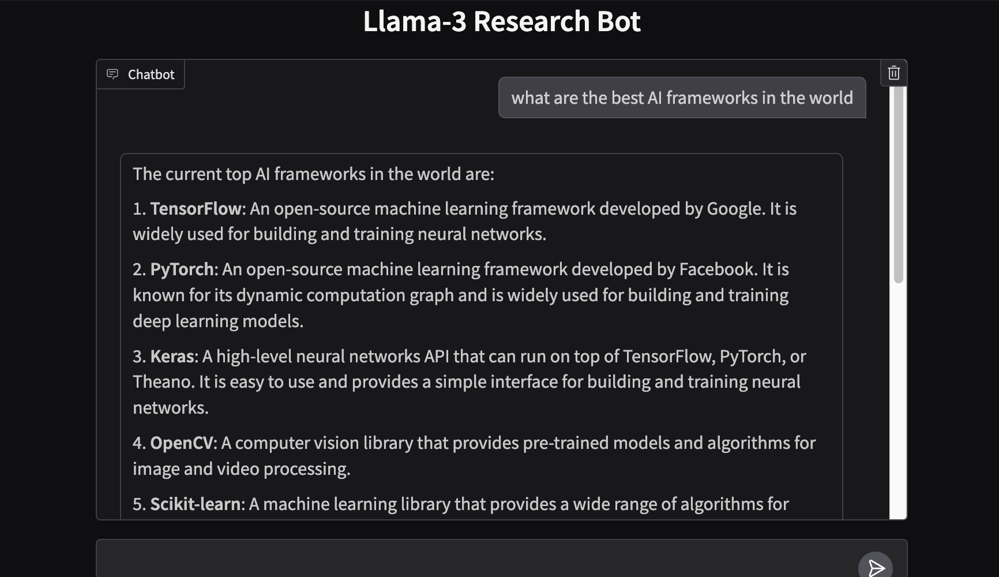

# 🧠 LLaMA 3.2 Local Research Assistant (Ollama + Gradio)

This project is a fully local, private AI assistant that uses **LLaMA 3.2** running with [Ollama](https://ollama.com/) to:

- Answer factual questions
- Dynamically call tools like web search or ticket pricing
- Display responses in an interactive Gradio chat UI

> ✅ No API keys, no cloud, no cost – 100% local!

---

## 📸 Demo

---

## 🚀 Features

- 🔍 **Web search tool** using DuckDuckGo + BeautifulSoup
- 🧾 **Summarization** via LLaMA 3.2's local language reasoning
- ✈️ Optional **ticket price lookup tool** example
- 🧠 Built on Ollama's tool-calling capabilities
- 💬 Fast chat UI powered by Gradio

---
